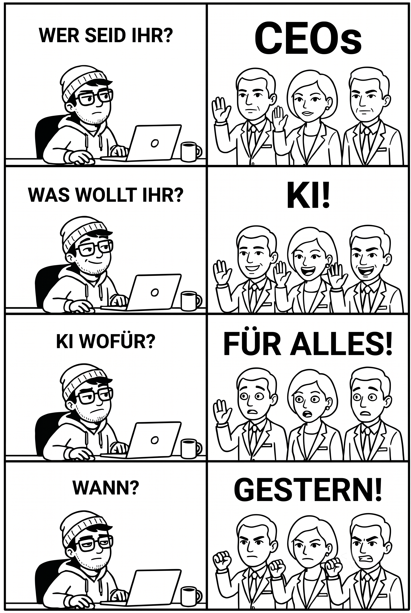
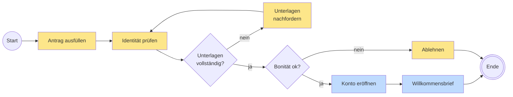

# Können wir das mit KI machen?

## Was sich in Unternehmen mit LLMs automatisieren lässt – und was nicht

DRAFT

  
    David Übelacker
  

---
layout: center
---

  

    
MM

    

      
Max Mustermann

      
Digital Transformation Evangelist | Keynote Speaker

      
2 Std. · 🌐

    

  

  

    
🔄 <b>Business Automation war gestern – jetzt übernehmen KI-Agenten.</b>

    
Starre Workflows, teure RPA-Bots: vorbei. KI-Agenten führen Prozesse nicht nur aus – sie denken und handeln eigenständig.

    
✅ Kein Workflow-Design mehr – Agenten lernen durch Beobachtung ✅ Flexibel statt starr – sie passen sich in Echtzeit an ✅ Keine Silos – sie arbeiten über alle Abteilungen hinweg

    
Wer heute noch auf klassische Automatisierung setzt, wird morgen überholt. 🚀💡

    
#AI #Automation #KIAgenten #FutureOfWork

  

  
👍💡❤️ 428 · 96 Kommentare · 51 Reposts

---

# Ein Bankkonto eröffnen

  <i class="swatch-human"></i>Mensch
  <i class="swatch-system"></i>System
  … und jeder Pfeil dazwischen: von Hand modelliert.

---

# Wer bin ich?

- **David Übelacker**
- Software Architect @ nag informatik ag in Basel
- 20+ Jahre Erfahrung in der Web- und Mobile-App-Entwicklung

  

    
    

    

      
      
uebelacker.dev

    

  

---
layout: fact
---

# Vielen Dank!

 

https://github.com/uebelack/can-we-do-this-with-ai
