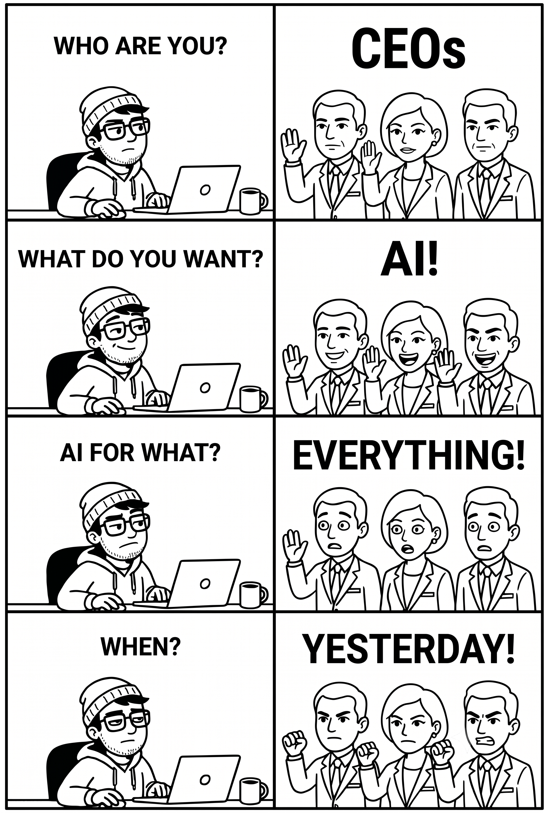
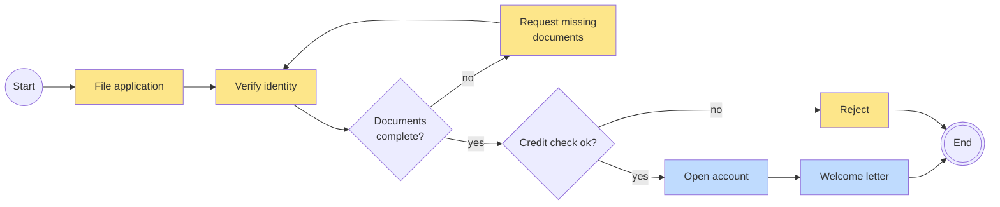

# Can We Do This with AI?

## What Enterprises Can Automate with LLMs, and What They Can't

DRAFT

  
    David Übelacker
  

---
layout: center
---

  

    
JD

    

      
Jane Doe

      
Digital Transformation Evangelist | Keynote Speaker

      
2h · 🌐

    

  

  

    
🔄 <b>Business automation is yesterday's news – AI agents are taking over.</b>

    
Rigid workflows, expensive RPA bots: over. AI agents don't just execute processes – they think and act on their own.

    
✅ No more workflow design – agents learn by watching ✅ Flexible instead of rigid – they adapt in real time ✅ No more silos – they work across every department

    
Anyone still betting on classic automation today will be left behind tomorrow. 🚀💡

    
#AI #Automation #AIAgents #FutureOfWork

  

  
👍💡❤️ 428 · 96 comments · 51 reposts

---

# Opening a Bank Account

  <i class="swatch-human"></i>Human
  <i class="swatch-system"></i>System
  … and every arrow between them: modelled by hand.

---

# Who am I?

- **David Übelacker**
- Software Architect @ nag informatik ag in Basel
- 20+ years of experience in web and mobile app development

  

    
    

    

      
      
uebelacker.dev

    

  

---
layout: fact
---

# Thank you!

 

https://github.com/uebelack/can-we-do-this-with-ai
